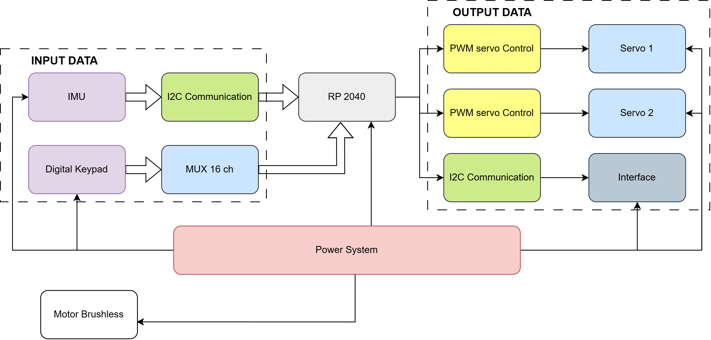

# Delta-TVC
Repositorio para el proyecto del curso de Electrónica Digital III

## Idea de Proyecto
El proyecto a realizar que se plantea es el diseño de un controlador de tipo PID (puede ser PI) para ángulo de empuje de un motor de cohete. En este caso por facilidad no sé realiza con propelente sólido, y se propone como alternativa para simular el empuje un motor brushless (y su ESC). Para medir la variable de control se utilizará una IMU y para realizar el control se utilizan servomotores que estabilizan el ángulo de inclinación. 

Adicionalmente se hará una interfaz de usuario empleando una pantalla LCD y teclado(medir viabilidad) que permita modificar los parámetros del controlador y muestre cuando el sistema se encuentra por fuera del rango del setpoint. 

Finalmente se miden variables significativas del sistema como: consumo de energía, voltaje, entre otros.

## Motivación
La motivación personal de este proyecto surge del desafío que representa la implementación de controladores PID en sistemas que interactúan de manera compleja con el entorno. Complementado con una curiosidad por aprender a desarrollar un sistema embedido y observar sus aplicaciones en la vida real. Además de que existe un interés **colectivo** dentro del equipo por los temas aeroespaciales y la cohetería.

## Diagrama de Bloques

## Requisitos Funcionales

**1. Procesamiento de Datos:**
- El sistema deberá adquirir datos de orientación en tiempo real desde una IMU (acelerómetro y giroscopio) mediante protocolo I2C. Además de aplicar un filtro que permita reducir el ruido de la adquisición.
- El sistema también calculará el error entre el setpoint y el ángulo del cohete para generar una señal de control que opere sobre los dos servos que orientan el empuje.

**2. Comunicación:**
- Debe permitir el ingreso de parámetros como las constantes de PID y ángulo de referencia mediante una interfaz de comunicación conectada al microcontrolador durante la configuración inicial. Y mostrarse en la pantalla OLED. 
- El sistema debe mostrar en una pantalla OLED conectada mediante I2C variables de estado como: Ángulo Actual y consumo de Energía.

**3. Control:**
- La señal generada por el MCU debe ser una señal de PWM para manipular los 2 servos, cada uno en un eje (Pitch & Yaw del cohete), los cuales determinan la orientación del motor Brushless.
- El sistema debe asegurar que los servos tengan una respuesta con mínimas oscilaciones y un tiempo de reacción menor a 200 ms.
- La señal de control del motor brushless es un PWM constante, ya que el empuje del motor no debe modificarse en el tiempo.

**4. Gestión de Energía:**
- Se deberá monitorear constantemente el voltaje de la batería y el consumo de energía empleando un sensor de corriente. Y además mostrando estos valores en la pantalla OLED.

## Requisitos No Funcionales
- **Rendimiento**: El sistema embebido debe mantener la estabilidad del ángulo del cohete dentro de un margen de error máximo del 5% respecto al valor objetivo (*setpoint*).
-	**Fiabilidad**: El sistema debe ser capaz de responder adecuadamente ante perturbaciones angulares de hasta 30 grados, garantizando un comportamiento controlado y seguro.
-	**Usabilidad**: Se debe proporcionar una interfaz de usuario intuitiva que permita visualizar en tiempo real el ángulo actual del sistema, así como ingresar de forma sencilla los parámetros del controlador PID.
-	**Tiempo de respuesta**: El sistema debe ser capaz de reaccionar ante una perturbación y estabilizar el ángulo en un tiempo inferior a 3 segundos.
-	**Consumo de Energía**: Considerando los tiempos y consumo del vuelo del cohete, el sistema debe estar encendido por lo menos 20 minutos durante el vuelo, y 5 minutos de control activo.

## Diseño de Pruebas
El día de la entrega se realizará una demostración estructurada en dos etapas principales. En la primera, se validará la implementación del controlador PID para estabilizar el ángulo de una plataforma a partir de las lecturas de una IMU. La Raspberry Pi Pico estará conectada a los servomotores encargados de corregir la inclinación, y se establecerá un ángulo de referencia (setpoint) fijo. Se aplicarán perturbaciones manuales a la plataforma y se observará si el sistema es capaz de corregirse automáticamente, evaluando el tiempo de respuesta, el sobreimpulso y la estabilidad. Paralelamente, se activará un motor brushless con su ESC como simulación del sistema de empuje, verificando que su integración no interfiera con el funcionamiento del sistema de control.

En la segunda parte, se probará la interfaz de usuario y el monitoreo de variables eléctricas. Se mostrará en una pantalla LCD información como el ángulo actual, los valores del PID, el setpoint y las lecturas de voltaje y corriente, medidas mediante un sensor. El evaluador podrá modificar los parámetros Kp, Ki y Kd desde un teclado matricial, y se comprobará que los cambios se reflejan en el comportamiento del sistema en tiempo real. También se evaluará la funcionalidad del menú y la precisión de las lecturas eléctricas. Este escenario permite validar el sistema de forma integral, demostrando tanto su desempeño como su capacidad de personalización y monitoreo.

## Presupuesto del Proyecto

| **Categoría**              | **Elemento**                                                      | **Cantidad** | **Costo estimado (COP)** | **Disponibilidad**       |
|---------------------------|-------------------------------------------------------------------|-------------:|--------------------------:|---------------------------|
| Componentes electrónicos  | Raspberry Pi Pico                                                 |           1  |                    22610  | Disponibilidad previa     |
| Componentes electrónicos  | IMU MPU-6050                                                      |           1  |                    14637  |                           |
| Componentes electrónicos  | Micro servo 9g ms18                                               |           2  |                    18000  |                           |
| Componentes electrónicos  | Motor Brushless                                                   |           1  |                    47000  | Disponibilidad previa     |
| Componentes electrónicos  | ESC                                                               |           1  |                    33000  |                           |
| Componentes electrónicos  | Pantalla OLED                                                     |           1  |                    30000  | Disponibilidad previa     |
| Componentes electrónicos  | [TM-4X4] Teclado matricial de 16 teclas (4x4)                     |           1  |                    16000  |                           |
| Componentes electrónicos  | Sensor INA219                                                     |           1  |                    15000  |                           |
| Componentes electrónicos  | Batería Lipo 14.8v 1500mah 130c V2 CNHL Black                     |           1  |                    20000  |                           |
| Componentes electrónicos  | Protoboard y cables                                               |           1  |                    10000  |                           |
| Componentes electrónicos  | Módulo Multiplexor CD74HC4067                                     |           1  |                     3400  |                           |
| Componentes electrónicos  | PCB (opcional)                                                    |               |                           |                           |
| Herramientas y equipos    | Multímetro digital                                                |           1  |                        0  | Disponibilidad previa     |
| Herramientas y equipos    | Estación de soldadura                                             |           1  |                        0  | Disponibilidad previa     |
| Herramientas y equipos    | Software de desarrollo                                            |               |                        0  |                           |
| Herramientas y equipos    | Banco de trabajo                                                  |               |                        0  |                           |
| Herramientas y equipos    | Impresora 3D                                                      |           1  |                        0  | Disponibilidad previa     |
| Herramientas y equipos    | CNC                                                               |           1  |                        0  | Disponibilidad previa     |
| Diseño y prototipado      | Diseño de PCB                                                     |               |                    15000  |                           |
| Diseño y prototipado      | Fabricación de PCB                                                |               |                    25000  |                           |
| Diseño y prototipado      | Impresión 3D                                                      |        1 kg  |                    72000  |                           |
| Diseño y prototipado      | Ensayos y validación                                              |               |                        0  |                           |
| Resumen general           | **Costo total estimado**                                          |               |                **341647**|                           |
